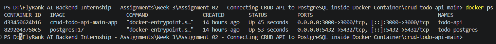
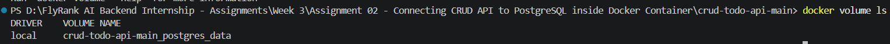
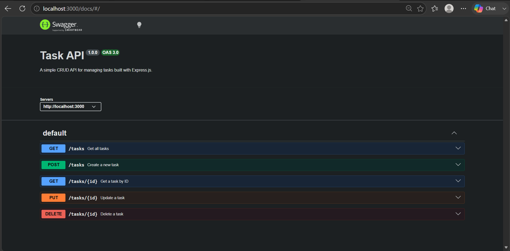

# 📋 Task API

A simple RESTful CRUD API for managing tasks with an AI-powered natural language task parser. Built with Express.js, PostgreSQL, OpenAI, Docker, and documented with Swagger/OpenAPI.

---

## 🧠 What This Is

A lightweight Task Management API that provides complete CRUD functionality for managing tasks, alongside an LLM endpoint that parses unstructured, plain-text task descriptions into structured JSON tasks.

This project uses a PostgreSQL database running inside Docker for persistent storage. The application and database can be started together using Docker Compose, providing a consistent development environment.

The project follows a layered architecture where route handlers delegate all database operations to a dedicated PostgreSQL repository. LLM parsing operations are handled by a dedicated validation and client module equipped with automated repair attempts and fallback mechanisms.

📖 Interactive API documentation is available through Swagger UI at `/docs`.

---

## ✨ Features

- ✅ Full CRUD operations for task management
- 🤖 AI-powered natural language task parsing endpoint (`POST /todos/parse`)
- 🛡️ Schema validation using Zod for strict LLM input and output guarantees
- 🔁 Single-attempt LLM repair loop for invalid JSON responses and quarantine logging
- 🔌 Circuit breaker / kill switch support (`LLM_ENABLED`) and stub mode for testing (`LLM_STUB`)
- 📊 Structured JSON logging for token usage, latency, and cost tracking
- 🗄️ PostgreSQL database for persistent storage
- 🐳 Dockerized application and database with Docker Compose orchestration
- 📘 Interactive API documentation with Swagger UI
- 🧪 Evaluation suite for prompt performance testing

---

## 🛠️ Tech Stack

| Category | Technology |
|-----------|-------------|
| Backend | Node.js & Express.js |
| AI / Validation | OpenAI SDK & Zod |
| Database | PostgreSQL & pg |
| Infrastructure | Docker & Docker Compose |
| Docs | Swagger UI & OpenAPI |

---

## 📁 Project Structure

```text
.
├── evals/
│   ├── cases.json
│   └── run-eval.js
├── images/
│   ├── docker-containers.png
│   ├── docker-volume.png
│   └── swagger-screenshot.png
├── logs/
│   └── .gitkeep
├── prompts/
│   └── parse-todo-v1.md
├── repos/
│   └── taskRepository.js
├── sql/
│   └── init.sql
├── src/
│   └── llm/
│       ├── client.js
│       ├── hello.js
│       └── schema.js
├── .env.example
├── .gitignore
├── app.js
├── database.js
├── docker-compose.yml
├── Dockerfile
├── JOB-CARD.md
├── openapi.json
├── package.json
└── README.md
```

---

## 🚀 Installation & Running

**1. Clone the repository and install dependencies:**

```bash
npm install
```

**2. Create a `.env` file from the provided example:**

```bash
cp .env.example .env
```

**3. Start the complete application stack using Docker:**

```bash
docker compose up
```

**Alternatively, run locally in development mode:**

```bash
npm run dev
```

🌐 The API will be available at: `http://localhost:3000`
📘 Swagger documentation: `http://localhost:3000/docs`

---

## 🔐 Environment Variables

Example `.env`:

```env
DATABASE_URL=postgres://postgres:password@db:5432/todo
PORT=3000
LLM_BASE_URL=https://openrouter.ai/api/v1
LLM_API_KEY=your_api_key_here
LLM_MODEL=openrouter/free
LLM_STUB=0
LLM_ENABLED=true
```

> ⚠️ The `.env` file is excluded from version control using `.gitignore`.
> A `.env.example` file is included for reference.

---

## 🗄️ Database

This project uses PostgreSQL running inside Docker. The schema is automatically initialized using `sql/init.sql`.

### Tasks Table

| Column | Type | Description |
|--------|------|--------------|
| id | SERIAL | Unique task identifier (Primary Key) |
| title | TEXT | Task title |
| done | BOOLEAN | Task completion status |

---

## 🔗 API Endpoints

| Method | Endpoint | Description |
|--------|----------|--------------|
| GET | `/` | API information |
| GET | `/health` | Health check |
| GET | `/tasks` | Retrieve all tasks |
| GET | `/tasks/:id` | Retrieve a task by ID |
| POST | `/tasks` | Create a new task |
| PUT | `/tasks/:id` | Update a task |
| DELETE | `/tasks/:id` | Delete a task |
| POST | `/todos/parse` | Parse raw task notes into structured JSON using AI |

---

## 🤖 Task Parser Endpoint (`POST /todos/parse`)

Parses unstructured plain-text notes into structured task objects with category, priority, confidence rating, and reasoning.

### 📤 Sample Request

```bash
curl -X POST http://localhost:3000/todos/parse \
  -H "Content-Type: application/json" \
  -d '{"text": "Buy groceries tomorrow at 5pm high priority"}'
```

### 📥 Sample Response

```json
{
  "title": "Buy groceries",
  "priority": "high",
  "category": "shopping",
  "confidence": 0.95,
  "reason": "Explicit shopping items with high priority specified"
}
```

---

## 📈 Prompt Evaluation Metrics

- 🎯 **Accuracy Score:** 8/8 (100%)
- 📝 **Active Prompt:** `prompts/parse-todo-v1.md`

To execute the test evaluation suite:

```bash
node evals/run-eval.js
```

---

## 🏗️ Architecture & Design Patterns

- **🗂️ Repository Pattern** — Database interactions are encapsulated within `repos/taskRepository.js`, separating data access logic from HTTP routes.
- **🛡️ Structured Validation & Resilience** — The LLM integration uses Zod schema validation to verify input lengths and enforce strict output JSON schemas. If an invalid response is returned, a single automated repair prompt is attempted before quarantining failed payloads to `logs/quarantine.jsonl`.
- **⚙️ Operational Safety** — Features built-in stubbing (`LLM_STUB=1`) for local unit testing without API credits, along with a kill switch (`LLM_ENABLED=false`) for graceful fallback when the model provider is offline.

---

## 🖼️ Screenshots

### 🐳 Docker

The application and PostgreSQL database are started together using Docker Compose.



### 💾 Persistence

Task data is stored in a persistent Docker volume.



### 📘 Swagger Documentation

Interactive API documentation is available at: `http://localhost:3000/docs`

